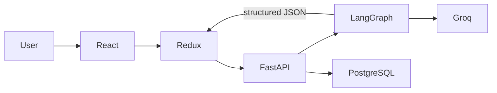
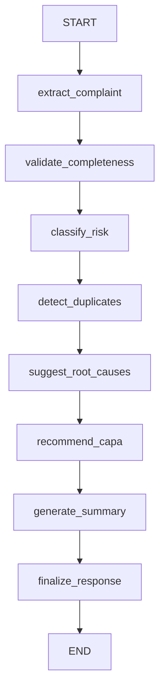

# AIVOA PharmaQMS AI

[](https://github.com/aryanshah012/Aivoa-pharma/actions/workflows/ci.yml)

AI-Powered Customer Complaint Management System for Pharmaceutical Manufacturing (API & FDF products).

An AI-assisted pharmaceutical complaint triage and investigation platform that converts
unstructured customer complaints (pasted text, email, PDF, TXT) into structured QMS
records, risk assessments, investigation suggestions and CAPA recommendations —
while keeping Quality personnel in control at every step.

> **AI Safety principle:** AI assists the Quality team. AI never makes final regulatory
> or quality decisions and never saves a complaint automatically. Every AI output is
> labeled: *"AI-generated suggestion — Quality review required."*

## Screenshots

_(Place dashboard, complaint form + AI copilot, and complaint detail screenshots here)_

## Problem

Pharma QA teams receive complaints as messy emails, PDFs and phone notes. Manually
re-typing them into a QMS is slow, error-prone, and delays triage. Critical signals
(patient harm, contamination, repeat batch defects) are easy to miss.

## Solution

Paste a complaint (or drop a PDF) → a LangGraph pipeline of 7 AI agents extracts a
structured record, checks completeness, assesses risk, finds duplicates, suggests
investigation areas and drafts CAPA → the form auto-populates → a human reviews, edits
and saves → the record persists in PostgreSQL and appears on the dashboard.

## Features

- Complaint intake via pasted text, pasted email, PDF upload, TXT upload
- Structured AI extraction into the Log Customer Complaint form (all fields editable)
- Deterministic completeness check + AI-generated follow-up questions
- AI Copilot risk assessment (5 dimensions, confidence, fact-based reasoning) + rule guardrails
- Explainable duplicate detection (batch/product/category + TF-IDF similarity)
- AI investigation hypotheses (never "confirmed root causes") and CAPA suggestions
- Short + management summaries
- Dashboard with QMS KPIs, filters, status/risk badges
- Audit trail (created, AI analysis, edits, risk/status changes, CAPA added)
- Auto-generated complaint numbers `CC-<year>-<seq>`

## Architecture





- Only `extract_complaint` is blocking. Every other node degrades gracefully:
  failure → `null` result + soft error, workflow continues.
- LLM responses are validated against Pydantic schemas; malformed JSON triggers one
  repair retry; the primary model (`gemma2-9b-it`) falls back to
  `llama-3.3-70b-versatile` on quota/unavailability.

## Tech Stack

| Layer    | Technology |
|----------|------------|
| Frontend | React 18, TypeScript, Redux Toolkit, React Router, Vite, Inter |
| Backend  | Python, FastAPI, Pydantic, SQLAlchemy 2 |
| AI       | LangGraph, Groq API (model configurable via env) |
| DB       | PostgreSQL (SQLite fallback for local dev only) |
| Docs     | pypdf (simple PDF text extraction) |

## Repository Layout

```
aivoa-pharma-qms/
├── frontend/          # React + TS + Redux Toolkit
├── backend/           # FastAPI + LangGraph agents
│   └── app/agents/    # state.py, graph.py, 7 agent nodes, prompts.py
├── sample_data/       # demo complaint emails + seed JSON (8 complaints)
├── docs/              # INTERVIEW_GUIDE.md, MANUAL_TEST_CHECKLIST.md
└── docker-compose.yml # frontend + backend + postgres
```

## Installation & Running

### 1. Backend

```bash
cd backend
python -m venv .venv && source .venv/bin/activate   # Windows: .venv\Scripts\activate
pip install -r requirements.txt
cp .env.example .env        # then edit: set GROQ_API_KEY
python -m app.db.init_db    # create tables (PostgreSQL or SQLite per DATABASE_URL)
python seed.py              # load 8 demo complaints (idempotent)
uvicorn app.main:app --reload
```

API docs: http://localhost:8000/docs · Health: http://localhost:8000/health

### 2. Frontend

```bash
cd frontend
npm install
cp .env.example .env        # VITE_API_BASE_URL=http://localhost:8000
npm run dev                 # http://localhost:5173
```

### 3. Docker (optional)

```bash
cp backend/.env.example backend/.env   # set GROQ_API_KEY
docker compose up --build
```

### 4. Tests

```bash
cd backend && pytest -q
```

## Environment Variables

See `backend/.env.example`. Nothing is hardcoded: `GROQ_API_KEY`, `DATABASE_URL`,
`GROQ_MODEL`, `GROQ_FALLBACK_MODEL`, `FRONTEND_URL`/`CORS_ORIGINS`, `MAX_UPLOAD_MB`.

## Demo Workflow

1. Dashboard → **Log Customer Complaint**.
2. Right panel → *Paste Email* tab → paste the contents of
   `sample_data/complaints/demo_complaint_email.txt` → **Analyze with AI**.
3. Watch progress steps; the form auto-populates (AI fields highlighted).
4. Review completeness, risk, duplicates, summary, investigation & CAPA suggestions.
5. Edit anything, then **Save Complaint** → it appears in the list and dashboard.
6. Open the record → change status/final risk → audit trail logs each change.

## API Endpoints

| Method | Path | Purpose |
|--------|------|---------|
| GET    | `/health` | Service + LLM config status |
| GET/POST | `/api/complaints` | List (with filters) / create |
| GET/PUT/DELETE | `/api/complaints/{id}` | Read / update / delete |
| POST   | `/api/complaints/analyze` | Text → LangGraph → full analysis |
| POST   | `/api/complaints/analyze-document` | PDF/TXT upload → analysis |
| POST   | `/api/complaints/{id}/risk-assessment` | Re-run AI analysis on a saved complaint |
| GET    | `/api/complaints/{id}/duplicates` | Duplicate matches |
| POST   | `/api/complaints/{id}/capa` | Add a CAPA action |
| POST   | `/api/complaints/{id}/root-cause` | Investigation + CAPA suggestions |
| GET    | `/api/dashboard/stats` · `/api/dashboard/recent` | Dashboard KPIs |

## Design Decisions

- **Deterministic where possible:** field completeness = plain Python; duplicate
  scoring = explainable weights + TF-IDF; complaint numbers = DB sequence. The LLM is
  reserved for extraction, reasoning text, summaries and suggestions.
- **Rule guardrails on AI risk:** adverse-event-reported ⇒ ≥ High; contamination ⇒
  Critical triage. The UI always labels AI risk as requiring Quality review.
- **Graceful degradation:** one failed optional agent never crashes the analysis.

## AI Safety / Human Review

AI outputs are decision support only. The app never auto-saves an AI-generated
complaint, every AI-populated field remains editable, and every AI panel carries the
disclaimer *"AI-generated suggestion — Quality review required."*

## Current Limitations

Single tenant, no authentication/RBAC yet, English only, no OCR for scanned PDFs,
attachments are validated but not persisted to disk, analysis is synchronous.

## Future Improvements

OAuth2/RBAC, Alembic migrations, async background analysis with job status, pgvector
embeddings for duplicate detection, vision-model OCR, CAPA approval workflow, email
ingestion, multi-language support.

## Interview Explanation

See [docs/INTERVIEW_GUIDE.md](docs/INTERVIEW_GUIDE.md) for concise answers on the
domain, architecture, LangGraph workflow, reliability and scaling.


## Engineering Standards

- Automated CI validates changes on pushes and pull requests.
- Dependabot monitors Python and/or JavaScript dependencies where applicable.
- [CONTRIBUTING.md](CONTRIBUTING.md) documents the development workflow and review expectations.
- [SECURITY.md](SECURITY.md) documents responsible vulnerability reporting and security principles.
